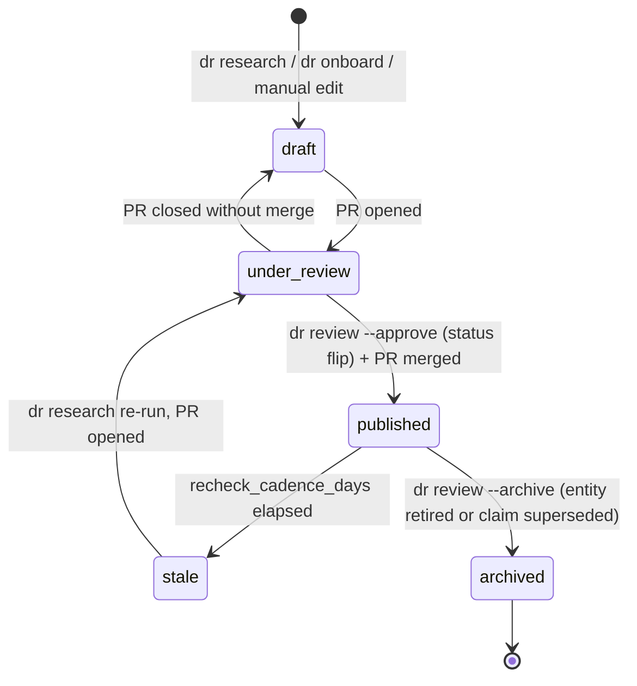
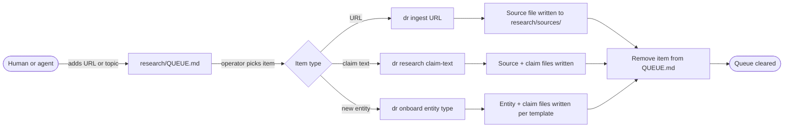
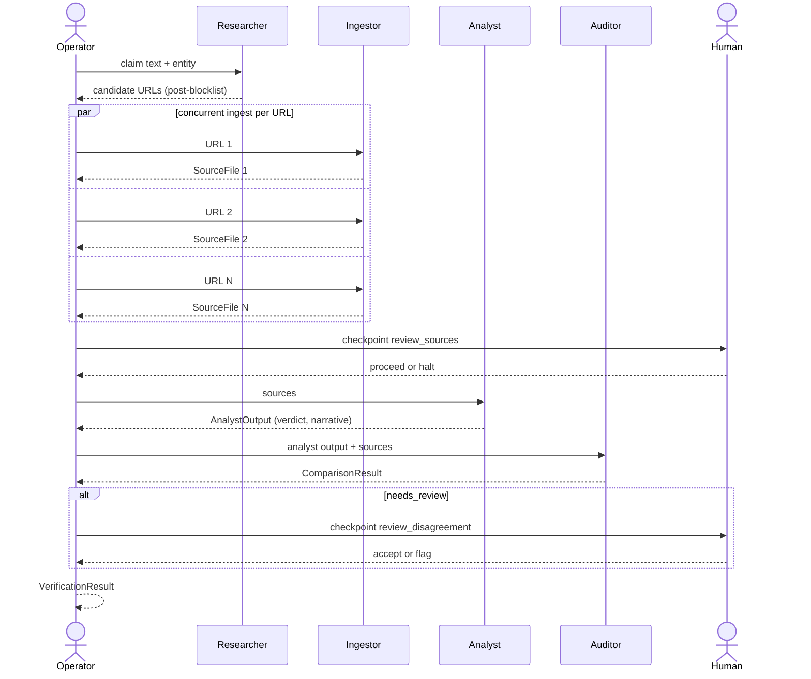
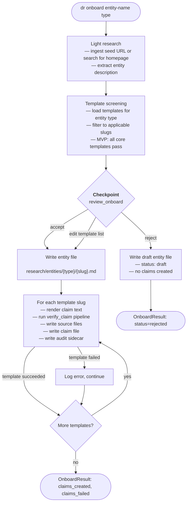
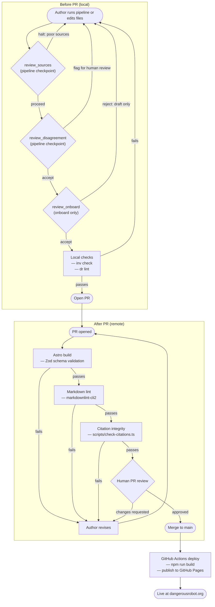

# Research Flow Diagrams

Visual reference for the research lifecycle. The first diagram is a state machine covering a claim from draft to archival. The remaining diagrams zoom into specific mechanisms: queue handling, pipeline execution, onboarding of new entities, and the sign-off path from PR open to merged and deployed.

Sections:

1. Claim lifecycle (state machine)
2. Queue lifecycle
3. Pipeline execution (sequence)
4. Onboard pipeline
5. Sign-off: before and after PR

---

## 1. Claim lifecycle

Every claim moves through the same five states regardless of how it was initiated (`dr research`, `dr onboard`, or a manual edit). Transitions are driven by pipeline events, PR events, or time-based staleness.

Notes:

- `draft` covers both pipeline-written files awaiting a PR and hand-edited files on a feature branch.
- `stale` is detected manually or by the Citation Auditor today (no scheduler yet).
- Archived claims remain in the repo but are excluded from published output.
- `draft` to `published` and `published` to `archived` transitions are driven by `dr review --approve` and `dr review --archive`, which flip `status` in the `.md` frontmatter after writing the audit sidecar (sidecar-first ordering). Bare `dr review` records a human sign-off in the sidecar without changing status.

---

## 2. Queue lifecycle

How items enter and exit the queue:

---

## 3. Pipeline execution

The core four-step pipeline as a sequence of messages between agents and the two human checkpoints. Ingestor calls run concurrently, one per URL returned by the Researcher.

---

## 4. Onboard pipeline

New entity path. Runs light research, screens templates, then loops the core pipeline once per applicable template.

---

## 5. Sign-off: before and after PR

Two zones separate pipeline-internal gates (run locally before a PR is opened) from CI gates and human review (run after the PR is opened). Rejections loop back to the zone that owns them.

Notes:

- Human sign-off on a claim is recorded by `dr review` (writes `human_review` in the audit sidecar). `dr review --approve` additionally flips `status: draft` to `status: published`, so sign-off and publish are a single operator step. `dr review --archive` retires a published claim. Bare `dr review` records a sign-off without changing status. See [`docs/plans/audit-trail.md`](../plans/audit-trail.md) for the CLI contract.
