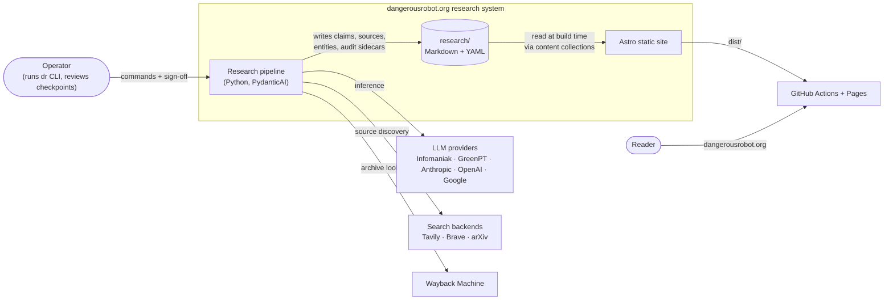
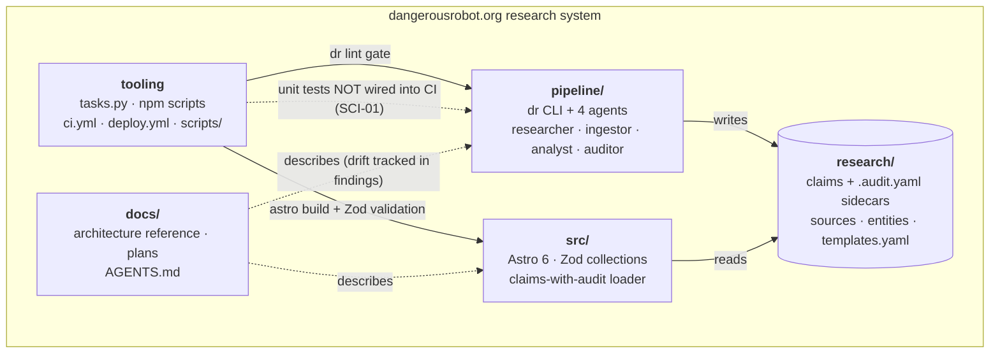
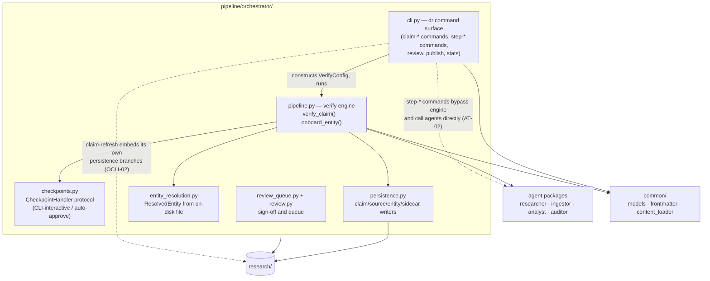
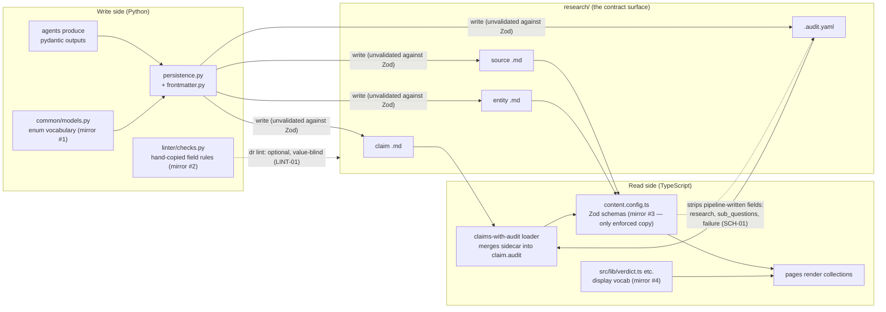

# Architecture diagrams

Companion to [`../ANALYSIS.md`](../ANALYSIS.md). Node inventory, metrics, and finding
references live in [`../data/architecture.json`](../data/architecture.json); the interactive
explorer renders the same data with zoom and drill-down. GitHub renders these Mermaid blocks
natively.

## L1 — System context

Why it matters: this is the audience-agnostic view. Everything the system does is a
consequence of one decision visible here: the pipeline and the site never talk to each
other — they share a folder of Markdown files.

## L2 — Containers (current)

Why it matters: the five containers have very different change rates and quality gates.
CI builds and gates the site on every push, but the pipeline's unit tests run only on a
developer's machine (finding SCI-01), and the docs container maintains role tables in six
places (DOCS-04).

The dashed edges are the two weakest links: docs describe code without any freshness check,
and CI gates content but not pipeline behavior.

## L3 focal view — orchestrator internals

Why it matters: `pipeline/orchestrator/` is the congestion center of the repo. The two
god-files (`pipeline.py`, hotspot #1; `cli.py`, hotspot #2 — see `data/metrics.json`
`hotspots_top30`) both contain a copy of persistence decisions, which is how findings like
OCLI-02 (diverged blocked/success persistence) happen.

## L3 focal view — the content integration boundary

Why it matters: this seam is where the repo's biggest structural bet lives. The pipeline
writes files with no schema check of its own; the only enforced contract is Zod at site
build — after the write already happened (PAT-01, SCH-01). Four hand-synced copies of the
vocabulary sit on this boundary (SCH-02).

