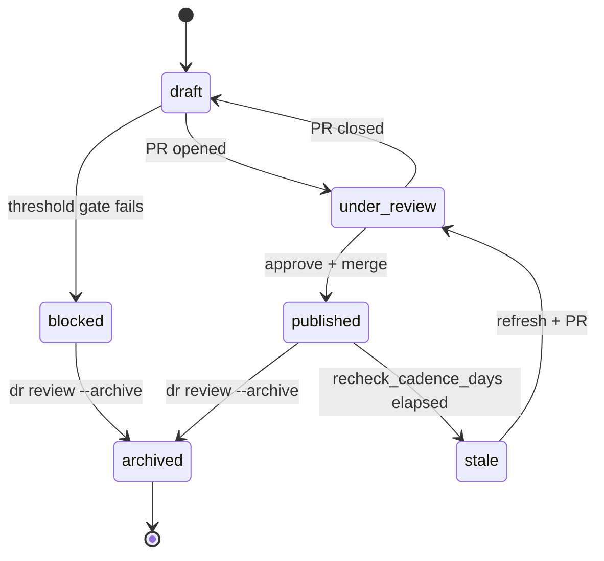
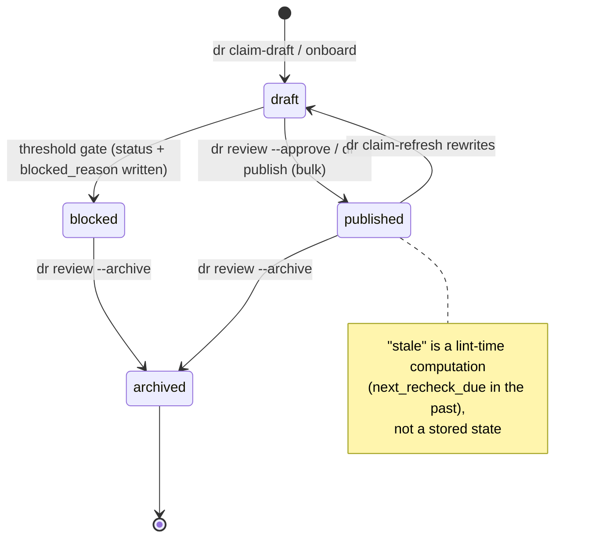
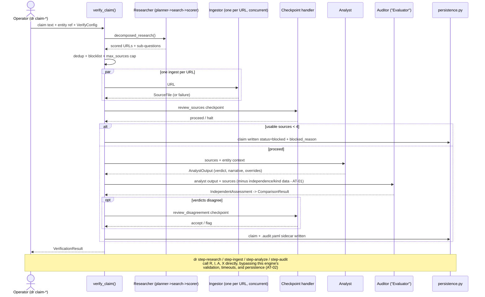
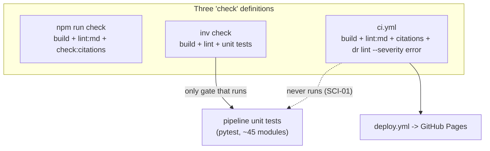

# Flow diagrams: documented vs implemented

Companion to [`../ANALYSIS.md`](../ANALYSIS.md). These diagrams pair what the
architecture docs promise with what the code stores and executes. Finding ids refer to
[`../data/findings.json`](../data/findings.json).

## Claim lifecycle — documented vs storable

Why it matters: `docs/architecture/research-flow.md` presents a six-state lifecycle, but
the schema (`ClaimStatus` in `pipeline/common/models.py`, mirrored by the `status` Zod enum
in `src/content.config.ts`) can store only four states. `under_review` and `stale` exist
only in prose: a claim "in review" is indistinguishable on disk from a draft, and staleness
is recomputed from `next_recheck_due` on every lint run rather than being a state (TAXD-04).

Documented (research-flow.md §1):

Storable today (`ClaimStatus`: `draft | published | archived | blocked`):

## verify_claim — the implemented sequence

Why it matters: this is the money path (`pipeline/orchestrator/pipeline.py`, hotspot #1).
The documented sequence in research-flow.md §3 matches this shape, but two things the docs
do not show: the `dr step-*` commands re-enter the agents *around* this engine with
diverged timeouts and validation (AT-02), and the auditor is asked to apply a confidence
cap without receiving the independence/kind data the cap depends on (AT-01).

## The quality gate — three definitions of "check"

Why it matters: "run the checks" resolves to three different command sets depending on
where you stand (SCI-02), and none of them runs the pipeline's unit tests in CI (SCI-01).

